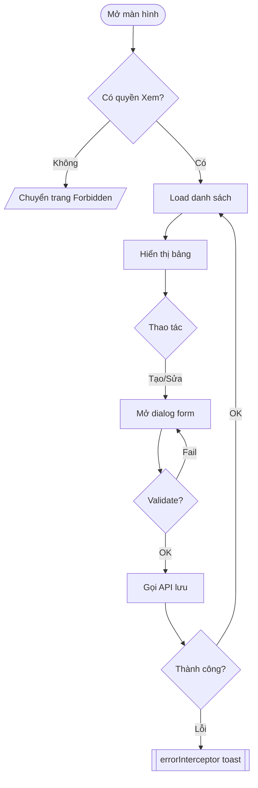
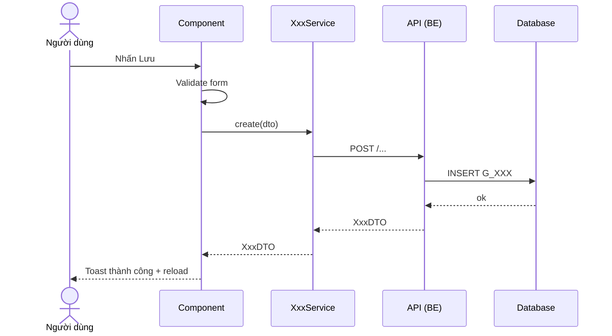

# Skill: Feature → Tài liệu BA (`docs/feature`)

Sinh **một tài liệu tổng hợp cho một chức năng** đã build xong, đặt tại `docs/feature/<slug>.md`.
Tài liệu này để người khác (BA/dev mới) đọc là hiểu chức năng làm gì, luồng ra sao, gọi API nào,
đụng bảng nào — mà không cần đọc code.

## Khi nào áp dụng
- User yêu cầu "tổng hợp / viết tài liệu / làm doc BA" cho một chức năng **đã hoàn thành**.
- Tham số bắt buộc: **thư mục chức năng** (vd `src/app/pages/sxd/ke-hoach`, `src/app/pages/vattu/material-catalog`).
- Nếu tài liệu đã tồn tại và chỉ cần cập nhật theo thay đổi mới → **KHÔNG** dùng skill này, dùng `feature-doc-update`.

## Input (hỏi nếu thiếu)
| Thông tin | Ví dụ | Bắt buộc |
|-----------|-------|----------|
| **Thư mục chức năng (FE)** | `src/app/pages/sxd/ke-hoach` | ✅ |
| Tên chức năng hiển thị | "Kế hoạch sản xuất điện năm" | Suy ra từ `<h1>`/route nếu thiếu |

**Backend là BẮT BUỘC** để mô tả nghiệp vụ đúng — KHÔNG suy đoán logic từ FE. Repo backend **tự xác định** từ
microservice của service (xem bảng map dưới), không cần user cung cấp. Chỉ khi thư mục backend không tồn tại
mới hỏi user / ghi rõ phần đó là *(suy luận từ FE, chưa đối chiếu BE)*.

### Map microservice → repo backend
Các repo backend là **thư mục anh em** của FE (`../pmis3-nguon-backend-<x>`). Context path `AC_* = 'pmis3-nguon-<x>/v1'` → repo `../pmis3-nguon-backend-<x>`:

| `AC_*` (FE) | Context path | Repo backend |
|-------------|--------------|--------------|
| `AC_QUANTRI` | `pmis3-nguon-quantri/v1` | `../pmis3-nguon-backend-quantri` |
| `AC_VATTU` | `pmis3-nguon-vattu/v1` | `../pmis3-nguon-backend-vattu` |
| `AC_SXD` | `pmis3-nguon-sxd/v1` | `../pmis3-nguon-backend-sxd` |
| (khác) | `pmis3-nguon-<x>/v1` | `../pmis3-nguon-backend-<x>` (scbd, sckk, tailieu, thietbi, vanhanh, notification…) |

### Bố cục backend (nơi tìm file)
| Thành phần | Vị trí | Cho biết |
|-----------|--------|----------|
| **Controller** | `<repo>/src/main/java/**/controller/*Controller.java` | Endpoint (`@RequestMapping`/`@GetMapping`…), **nguồn tham số** (chú ý `@RequestHeader("orgid")`, `@RequestParam`, `@RequestBody`), request/response |
| **Service** | `<repo>/src/main/java/**/service/*Service.java` | **Logic nghiệp vụ thật**: validate, check trùng, ràng buộc chéo, trạng thái, phân quyền (`grantedPermissionService.orgGrantedForUserToRead/Write`), **thông báo lỗi** |
| **DTO** | `<repo>/src/main/java/**/dto/*DTO.java` | Cấu trúc request/response, `@Valid` constraints |
| **Repository** | `<repo>/src/main/java/**/repository/*Repository.java` | Query method / native SQL, tên bảng khi dùng SQL thuần |
| **Entity (bảng thật)** | **module chung** `../pmis3-nguon-backend-common/pmis3-nguon-info-entity/src/main/java/**/info/entity/*.java` | `@Table(name=...)`, `@Column(name=...)`, `@Id`/`@EmbeddedId` → **tên bảng & cột DB chính xác** |

> ⚠️ Entity KHÔNG nằm trong repo microservice mà ở **module dùng chung** `pmis3-nguon-info-entity`. Bảng/cột DB phải lấy từ đây, đừng suy từ tên FE.
> Cách khớp FE→BE: lấy path sau context ở `baseUrl` FE (vd `/vattu-nhom`) → tìm controller có `@RequestMapping("/vattu-nhom")` trong repo tương ứng.

## Quy trình trích xuất (làm tuần tự)

**B1 — Đọc lớp UI của chức năng.** Trong thư mục chức năng, đọc:
- `*.ts` (component chính, extends `BaseComponent`): signals state, `ngOnInit`, các action (create/edit/delete/search/export…), quyền (`canView/canCreate/canUpdate/canDelete`), dùng `AppStore.selectedOrganization()` không.
- `*.html`: bảng/cột hiển thị, form field + validators, dialog, nút hành động, phân trang, filter.
- `*.routes.ts` (hoặc route trỏ tới): path, guard, `data.permission`/code màn hình.
- Thư mục con `components/` nếu có (dialog, picker…).

**B2 — Lần theo Service.** Với mỗi service được inject trong component:
- Mở file service ở `src/app/services/**`.
- Trích **từng method được chức năng gọi**: HTTP verb, đường dẫn đầy đủ (`baseUrl` + path), request DTO, response DTO, query params (chú ý pagination 0-based, search keyword).
- Ghi rõ **microservice/context** (`AC_*` hard-code, hoặc getter qua `ApiContextResolver`).

**B3 — Đọc BACKEND tương ứng (bắt buộc).** Xác định repo theo `AC_*` (bảng map ở trên), rồi với **mỗi endpoint** FE gọi:
- Mở **controller** khớp `@RequestMapping` → xác nhận method/path, và **nguồn từng tham số** (header `orgid`, param, body). Chú ý tham số **ẩn phía FE gửi qua interceptor** (vd `orgid` là `@RequestHeader`, không nằm trong body).
- Mở **service** tương ứng → trích **luật nghiệp vụ**: kiểm tra quyền theo đơn vị (`orgGrantedForUserToRead/Write`), check trùng khóa, ràng buộc "không được đổi mã/đơn vị", so khớp org header vs body, tính toán/mặc định, giao dịch (`@Transactional`), và **các message lỗi** (đưa vào luồng ngoại lệ).
- Mở **entity** ở module chung `pmis3-nguon-info-entity` → lấy **tên bảng `@Table` + cột `@Column` + khóa `@Id`/`@EmbeddedId`** thật (không suy từ FE).
- Nếu repo backend không tồn tại/không truy cập được → ghi rõ `(suy luận từ FE, chưa đối chiếu BE)` cho phần đó.

**B4 — Lần theo Model (FE) + đối chiếu.** Với DTO/model FE (`src/app/models/**`):
- Liệt kê field chính (tên, kiểu, ý nghĩa), field audit (`userCr*`, `userMdf*`) nếu extends `AuditDTO`.
- **Đối chiếu** field FE ↔ cột entity BE (B3) để bảng "Dữ liệu liên quan" là **tên bảng/cột DB thật**.

**B5 — Xác định luồng.**
- **Luồng chính**: chuỗi thao tác người dùng phổ biến nhất (mở màn hình → load danh sách → tạo/sửa/xóa/xuất…), **kèm bước xử lý phía BE** (validate/quyền/ghi DB) lấy từ service.
- **Luồng ngoại lệ**: gộp cả FE và BE — validate form (FE), không có quyền (guard FE + `orgGranted*` BE → 403), **các lỗi nghiệp vụ BE** (trùng mã, đổi mã bị chặn, org không khớp… với đúng message), API lỗi (toast qua `errorInterceptor`), danh sách rỗng, xác nhận xóa.

**B6 — Sinh sơ đồ (Mermaid).** Bắt buộc có:
- **Activity diagram** (`flowchart TD`): luồng nghiệp vụ chính + nhánh ngoại lệ (quyền, validate FE + luật BE, lỗi API).
- **Sequence diagram** (`sequenceDiagram`): tương tác `User → Component → Service → Controller(BE) → Service(BE) → DB` cho ≥1 kịch bản trọng tâm (thường là Tạo/Sửa hoặc Load danh sách) — thể hiện cả bước validate/quyền phía BE.

**B7 — Ghi tài liệu** theo đúng template bên dưới vào `docs/feature/<slug>.md`.
- **`<slug>` đặt theo TÊN CHỨC NĂNG tiếng Việt** (không theo tên thư mục code tiếng Anh): lấy tên hiển thị ở `<h1>`/breadcrumb → **bỏ dấu**, chữ thường, thay khoảng trắng bằng `-` (kebab-case ASCII, đúng convention thư mục dự án như `co-cau-huy-dong-nguon`).
  - VD: "Quản lý Nhóm vật tư" → `quan-ly-nhom-vat-tu.md`; "Kế hoạch sản xuất điện năm" → `ke-hoach-san-xuat-dien-nam.md`; "Cơ cấu huy động nguồn" → `co-cau-huy-dong-nguon.md`.
  - Bỏ tiền tố lặp như "Quản lý/Danh sách" nếu tên quá dài, giữ phần định danh; nếu **trùng tên file** đã có, thêm hậu tố phân biệt theo phân hệ (vd `...-vat-tu`, `...-sxd`).
- Nếu `docs/feature/` chưa có thì tạo.
- Lấy ngày cập nhật: chạy `git log -1 --format=%cd --date=format:%d/%m/%Y -- <thư mục>` (fallback: ngày hiện tại). Lấy commit: `git log -1 --format=%h -- <thư mục>`.
- **Không bịa**. Field/API/bảng nào không xác minh được từ code thì ghi `(chưa xác định)` hoặc `(suy luận)`, đừng đoán bừa.

## Template tài liệu (bám sát cấu trúc, dùng tiếng Việt)

```markdown
# <Tên chức năng>

> **Thư mục:** `<đường dẫn feature>` · **Route:** `<path>` · **Mã màn hình/permission:** `<code>`
> **Microservice:** `<AC_*>` · **Cập nhật:** `<dd/MM/yyyy>` · **Commit:** `<hash>`

## 1. Tổng quan
Mô tả ngắn (3–6 câu): chức năng này để làm gì, ai dùng, đặt ở đâu trong hệ thống, phạm vi (CRUD/ báo cáo/ nhập liệu…).

## 2. Vai trò & Quyền
| Quyền | Code | Ảnh hưởng UI |
|-------|------|--------------|
| Xem | `...` | Vào màn hình, xem danh sách |
| Thêm/Sửa/Xóa/Xuất | `...` | Hiện/ẩn nút tương ứng |
- Lọc theo đơn vị: <có/không, dùng `AppStore.selectedOrganization()`>.

## 3. Input / Output
**Input (người dùng nhập / tham số):**
| Trường | Kiểu | Bắt buộc | Ràng buộc/Validate | Ghi chú |
|--------|------|----------|--------------------|---------|
| ... | ... | ... | ... | ... |

**Output (hiển thị / kết quả):**
| Nội dung | Nguồn | Ghi chú |
|----------|-------|---------|
| Danh sách ... | API `GET ...` | phân trang, sắp xếp |
| File Excel ... | API `... /export` | (nếu có) |

## 4. Danh sách API sử dụng
| # | Chức năng | Method | Endpoint | Tham số (nguồn) | Request body | Response | Service FE → Controller/Service BE |
|---|-----------|--------|----------|-----------------|--------------|----------|-------------------------------------|
| 1 | Lấy danh sách | GET | `/.../` | `orgid` (header), `keyword/page/size` (query) | — | `ApiResponse<XxxDTO[]>` | `XxxService.getAll()` → `XxxController.getAll()` |
| 2 | Tạo | POST | `/...` | `orgid` (header) | `XxxDTO` | `ApiResponse<XxxDTO>` | `create()` → `XxxService.create()` |
| ... | | | | | | | |
> Ghi rõ tham số **truyền qua header** (vd `orgid`) mà FE gắn tự động qua interceptor — dễ bị bỏ sót nếu chỉ đọc FE.
> Pagination: UI 1-based → API 0-based. Lỗi API do `errorInterceptor` tự toast.

## 5. Bảng dữ liệu liên quan (từ entity backend)
Lấy từ entity ở `pmis3-nguon-info-entity` (`@Table`/`@Column`), KHÔNG suy từ FE.
| Bảng | Vai trò | Cột (tên DB thật) | Khóa/Quan hệ | Entity |
|------|---------|-------------------|--------------|--------|
| `G_XXX` | Bảng chính | `MA_XXX, TEN, TRANG_THAI, ORGID, ...` + audit | PK `MA_XXX` | `com...info.entity.GXxx` |
| `G_XXX_NHOM` | Danh mục liên kết | ... | FK `NHOM_ID` | `GXxxNhom` |
> Nếu backend không truy cập được: ghi cột suy luận từ FE và đánh dấu *(suy luận, chưa đối chiếu entity)*.

## 6. Luồng chính
Mô tả từng bước (numbered). Ví dụ:
1. Người dùng mở màn hình → `ngOnInit()` gọi `loadData()`.
2. ...

### Activity diagram


### Sequence diagram (kịch bản: <Tạo mới / Load danh sách>)


## 7. Luồng ngoại lệ
| # | Tình huống | Xử lý | Thông báo |
|---|-----------|-------|-----------|
| 1 | Không có quyền | Guard chặn / ẩn nút | Redirect Forbidden |
| 2 | Validate form fail | Chặn submit, highlight field | Message inline |
| 3 | API lỗi (4xx/5xx) | `errorInterceptor` | Toast tự động |
| 4 | Danh sách rỗng | Hiện empty state | "Không có dữ liệu" |
| 5 | Xóa | Confirm dialog trước khi gọi API | "Bạn có chắc..." |

## 8. Logic nghiệp vụ đặc thù (chủ yếu từ service BE)
Ghi các quy tắc không hiển nhiên — **trích từ service backend**, không đoán từ FE:
- Phân quyền theo đơn vị (`orgGrantedForUserToRead/Write`), kiểm tra trùng khóa, ràng buộc "không được đổi mã/đơn vị".
- So khớp `orgid` header vs body, giá trị mặc định, tính toán, trạng thái/workflow, giao dịch (`@Transactional`).
- Bulk action, mapping cột đặc biệt, xử lý file/ảnh, copy-paste Excel (AG Grid), native SQL nếu có.
- Ghi kèm **message lỗi thật** của BE (để đối chiếu với mục 7).

## 9. Thành phần & File liên quan
| Loại | File |
|------|------|
| Component (FE) | `.../xxx.ts`, `.../xxx.html` |
| Route (FE) | `.../xxx.routes.ts` |
| Service (FE) | `src/app/services/xxx.service.ts` |
| Model (FE) | `src/app/models/xxx.model.ts` |
| Controller (BE) | `<repo>/.../controller/XxxController.java` |
| Service (BE) | `<repo>/.../service/XxxService.java` |
| Repository (BE) | `<repo>/.../repository/XxxRepository.java` |
| Entity (BE) | `pmis3-nguon-info-entity/.../info/entity/Xxx.java` |
| Shared dùng lại | `AuditHistoryCardComponent`, `MaterialPickerDialogComponent`, ... |

## 10. Ghi chú / Vấn đề còn mở
- (tùy chọn) điểm chưa xác định, TODO, giả định đang dùng.
```

## Nguyên tắc chất lượng
- **Mermaid phải render được**: node có nhãn tiếng Việt bọc trong `[]`/`()`; tránh ký tự đặc biệt gây lỗi parse (dùng dấu ngoặc kép nếu nhãn chứa `()`).
- **Nghiệp vụ lấy từ backend**, không đoán từ FE. Bảng DB = entity thật (`@Table`/`@Column`), luồng ngoại lệ = message lỗi thật của service BE.
- **Bảng API/DB phải khớp code** — mỗi dòng phải truy được về 1 method service FE ↔ 1 controller/service BE ↔ 1 entity thật.
- Ưu tiên **súc tích, đúng**; không viết văn dài. Chỗ chưa chắc → đánh dấu rõ, không bịa.
- Tài liệu là **markdown thuần**, không kèm code implementation dài (chỉ trích đoạn nếu thật cần minh họa logic).
- Sau khi ghi file, báo lại đường dẫn `docs/feature/<slug>.md` và tóm tắt các API/bảng/logic BE đã tổng hợp.

## Kiểm chứng
Sau khi viết xong, **chạy thử trên đúng thư mục chức năng** user đưa và mở lại file kết quả để chắc chắn:
sơ đồ Mermaid hợp lệ, bảng API khớp service FE + controller BE, bảng DB khớp entity (`@Table`), luồng ngoại lệ khớp
message lỗi service BE, và không còn placeholder `<...>` sót lại.
